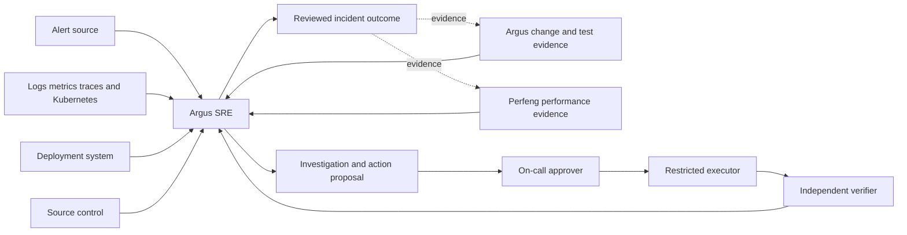

# Argus SRE architecture overview

## TL;DR

- Argus SRE starts as a capability-oriented modular monolith with separate
  logical read, approval, execution, and verification authorities.
- An investigation operates over bounded, typed evidence references rather than
  unrestricted production access or an unbounded model context.
- Product state, credentials, authorization, and lifecycle remain independent
  from Argus and Perfeng.
- Cross-product integration uses versioned contracts and immutable artifacts;
  common code is extracted only after identical semantics are demonstrated.
- Runtime language, database, model provider, deployment topology, and queue are
  deliberately deferred to milestone-specific ADRs.

## Purpose and authority

This document defines logical components, information flow, trust boundaries,
and architectural constraints. The [product definition](../product/product-definition.md)
governs behavior and safety. Accepted [ADRs](../decisions/README.md) govern
durable choices. The [roadmap](../roadmap/milestones.md) governs delivery order.

## System context

Observability, SCM, deployment, Argus, and Perfeng remain systems of record for
their own data. Argus SRE owns the incident interpretation and provenance of the
decision it publishes.

## Architectural principles

- **Evidence before conclusion.** Every material claim cites immutable or
  reproducibly queryable evidence and identifies inference explicitly.
- **Read and write authority are separate.** Investigation credentials cannot
  mutate production. Execution accepts only an approved typed action.
- **Verification is independent.** Proposal generation and command completion
  cannot declare remediation success.
- **Bounded tool use.** Every query defines target, time window, result size,
  timeout, cancellation, redaction, and audit behavior.
- **Conservative outcome.** Unsupported, unavailable, contradictory, or
  prompt-injected evidence causes request, escalation, or abstention.
- **Replaceable intelligence.** Deterministic correlation, search, ranking, and
  model reasoning sit behind versioned inputs and measured outputs.
- **Immutable identity and provenance.** Incidents, investigations, evidence,
  deployments, policies, models, prompts, tools, proposals, approvals, attempts,
  and verification results pin exact identities or revisions.
- **Independent products.** Argus and Perfeng expose evidence contracts; they do
  not become libraries, private databases, or deployment dependencies.

## Logical capabilities

| Capability | Owns | Does not own |
|:--|:--|:--|
| Incident intake | Authentication, deduplication, normalized alert and incident identity | Alert-provider routing policy |
| Evidence acquisition | Bounded queries, redaction, integrity, provenance, and immutable references | Observability systems of record |
| Investigation | Hypotheses, findings, contradiction, ranking, budgets, and abstention | Production mutation |
| Knowledge | Reviewed service facts, investigation guidance, expiry, and source attribution | Authoritative runtime state |
| Action policy | Allowed action classes, preconditions, risk, blast radius, and approval requirements | Credential delivery or execution |
| Approval | Reviewer identity, exact proposal binding, expiry, and revocation | Proposal generation |
| Execution | One approved operation through narrowly scoped credentials | Choosing or widening the action |
| Verification | Recovery conditions, guardrail checks, timeout, and verdict | Treating process success as recovery |
| Outcome learning | Reviewed incident outcome and downstream evidence publication | Automatic policy or baseline mutation |
| Offline evaluation | Replay, baselines, scoring, calibration, safety regression, and cost | Inline override of hard policy |

These are logical boundaries, not predetermined services. A boundary becomes a
separate process only when authority, failure isolation, runtime, scale, or
ownership evidence requires it. The write-capable executor is the earliest
likely security-driven process boundary.

## Investigation flow

1. Intake verifies the delivery and creates or retrieves one durable incident.
2. A coordinator snapshots policy, model, prompt, tool, and evidence budgets.
3. Deterministic correlation resolves service, environment, deployment, and
   change identities before model reasoning.
4. The investigator requests bounded evidence through consumer-owned ports.
5. Adapters validate and redact untrusted responses, persist large evidence as
   immutable artifacts, and return compact typed observations.
6. The investigator publishes findings, contradictions, missing evidence,
   hypotheses, and one explicit terminal outcome.
7. `PROPOSE_ACTION` creates a typed proposal and verification plan but grants no
   execution capability.
8. A later supervised-execution milestone binds human approval to the exact
   proposal and invokes the restricted executor.
9. The verifier evaluates recovery and guardrails independently and records a
   passed, failed, or inconclusive result.

Every retry is correlated and idempotent. Remote calls stay outside database
transactions. Late evidence cannot silently rewrite a completed investigation;
it creates a new revision or follow-up investigation.

## Evidence workspace and tool boundary

Large logs, traces, metrics, diffs, reports, and diagnostic files remain outside
the model context. The evidence layer may expose search-like operations over a
read-only investigation workspace, but it MUST NOT expose an unrestricted host
shell or ambient filesystem.

A tool descriptor defines:

- stable tool and schema version;
- read or write authority;
- allowed target and tenant scope;
- input and output bounds;
- timeout, concurrency, retry, and cancellation semantics;
- redaction and retention policy;
- deterministic error classification; and
- evidence produced for audit and replay.

Tool descriptions and returned content are untrusted data. A model-selected
tool name is a request; server-owned policy resolves whether the operation is
available and authorized.

## Trust and authority boundaries

The initial investigator is read-only. Its connectors use per-source,
least-privilege credentials and cannot cross tenant or environment scope. Model
providers receive only the bounded and redacted material required for the
current step.

Supervised execution later introduces three separate decisions:

1. action policy determines whether the action class may be proposed;
2. an authenticated human approves the exact immutable proposal; and
3. the executor independently revalidates target, precondition, approval,
   expiry, and current policy before acquiring a narrow credential.

The verifier receives observation authority but no permission to repeat or
expand the action. Approval tokens are audience-bound, single-purpose,
short-lived, and replay-protected.

## Cross-product contracts

Integration follows this order:

1. agree on vocabulary and semantic ownership;
2. publish Effect-authored or otherwise reviewed language-neutral schemas,
   fixtures, and compatibility rules in the owning product;
3. consume exact released or content-addressed contract versions;
4. add conformance tests in every producer and consumer; and
5. extract a neutral contract or library only when at least two production
   consumers require identical semantics and independent lifecycle ownership.

Argus SRE may adopt proven patterns from sibling products, including immutable
evidence, attempt identity, checksum verification, lease fencing, and secret-safe
failure classification. It MUST NOT import their private implementation, read
their private tables, or assume a sibling checkout.

Expected integration projections are:

- **Argus:** change, capability impact, execution decision, execution outcome,
  adaptation, and review evidence.
- **Perfeng:** performance assessment, measurement-quality outcome, baseline and
  workload identity, environment identity, and diagnostic artifact references.
- **Argus SRE:** incident assessment, action proposal, execution observation,
  verification outcome, and reviewed incident learning.

The first shared contract should emerge from the Argus–Perfeng integration
rather than being invented in this repository. Argus SRE consumes that boundary
and proposes extraction only if its semantics are genuinely product-neutral.

## Data, persistence, and deployment

Persistence technology is not selected yet. Durable storage will eventually
separate incident lifecycle state, immutable evidence metadata, approval and
execution audit, and large artifact bytes. Raw production evidence requires
explicit retention, encryption, tenant isolation, redaction, and deletion
policy before ingestion.

The initial source topology is one product repository and, once executable, one
modular control plane. A model worker, evidence processor, executor, or verifier
may split when a security or runtime boundary is demonstrated. A queue,
Kubernetes deployment, or multi-agent topology is not assumed.

The product may consume a qualified project-neutral Kubernetes substrate, but
it owns its namespaces, identities, secrets, state, release selection, rollout,
and rollback. Another product's environment repository does not become its
deployment owner.

## Evaluation architecture

Recorded investigations contain redacted input evidence, expected root-cause
labels where known, acceptable and unsafe actions, temporal constraints, and
review outcomes. Replays pin the complete decision configuration and produce a
new result without mutating the original record.

Deterministic scorers verify identity, citations, chronology, bounds, policy,
and action safety. Semantic judges may assess explanation or hypothesis quality,
but their model and rubric are versioned and their results remain separate from
deterministic safety gates. Chronological holdouts and injected faults prevent
the replay corpus from becoming a prompt-shaped answer key.
