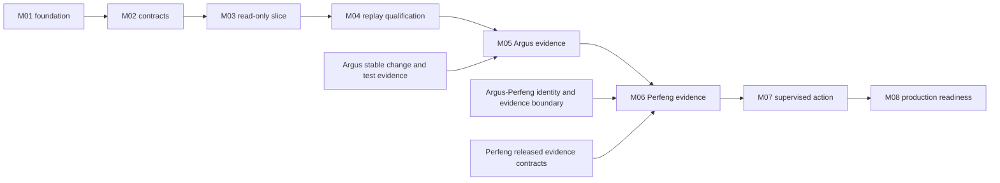

# Argus SRE implementation milestones

## TL;DR

- Eight outcome milestones progress from a verified repository to read-only
  investigation, cross-product evidence, supervised action, and production
  readiness.
- The first useful product slice is a read-only investigation of one bounded
  Kubernetes post-deployment regression, not a generic agent framework.
- Argus integration follows stable change and test evidence; Perfeng integration
  follows the planned Argus–Perfeng identity and evidence boundary.
- Production execution is deferred until replay, shadow, approval, isolation,
  rollback, and independent-verification gates are proven.
- Delivery slices combine contracts, implementation, tests, persistence,
  adapters, and documentation into substantial reviewable outcomes.

## Milestone index

| Milestone title | Short message |
|:--|:--|
| M01 - Trusted product foundation | Make product authority, safety, and every change reviewable. |
| M02 - Incident and evidence contracts | Give incidents, evidence, findings, and proposals stable meaning. |
| M03 - Read-only investigation | Turn one bounded Kubernetes alert into a cited investigation. |
| M04 - Replay-qualified reasoning | Measure investigation quality, safety, cost, and abstention before action. |
| M05 - Change intelligence integration | Correlate incidents with trustworthy Argus change and test evidence. |
| M06 - Performance evidence integration | Correlate incidents with trustworthy Perfeng performance evidence. |
| M07 - Supervised remediation | Execute one exact approved action and verify recovery independently. |
| M08 - Production readiness | Operate the product securely, observably, recoverably, and at scale. |

## Sequencing and cross-project gates

Milestone numbers describe Argus SRE delivery order; they do not imply matching
numbers or synchronized releases in Argus or Perfeng. GitHub owns live milestone
and issue state.

M03 and M04 can progress using source and deployment evidence without waiting
for cross-product integrations. M05 consumes only stable Argus projections. M06
must not invent a second Argus–Perfeng vocabulary; it consumes or extends the
contract boundary established by their planned integration.

The first production write remains blocked until M04 safety evidence is
accepted and M07 implements the complete approval, executor, rollback, and
verification boundary. Completing a list of components is not promotion
evidence.

## Delivery slices

| Milestone | Delivery slice | Bundled outcome |
|:--|:--|:--|
| M01 | Product and contributor foundation | Establish the repository harness, product definition, conceptual architecture, product-boundary ADR, security policy, and delivery roadmap. |
| M01 | Runtime and contract-toolchain decision | Spike the read-only incident path, select runtime and contract tooling by ADR, and create the smallest executable process with health and graceful shutdown. |
| M02 | Incident intake and evidence identity | Define versioned incident, alert, deployment, evidence-reference, provenance, and bounded-query contracts with shared fixtures and strict domain conversion. |
| M02 | Investigation and action proposal | Define finding, hypothesis, investigation outcome, action proposal, and verification-plan contracts with safe model-output validation. |
| M03 | Durable read-only incident flow | Authenticate and deduplicate intake, persist incident revisions, coordinate bounded work, and publish a deterministic investigation record. |
| M03 | Kubernetes post-deployment evidence | Correlate one service alert with deployment, Kubernetes, metrics, logs, and source-change evidence through least-privilege adapters. |
| M04 | Recorded replay and baselines | Build a redacted temporal corpus, deterministic baseline, replay runner, safety scorers, cost accounting, and chronological holdout. |
| M04 | Shadow investigation qualification | Run beside human response, capture structured review, calibrate confidence and abstention, and publish promotion or limitation evidence. |
| M05 | Argus evidence consumption | Consume pinned change, capability-impact, execution-decision, attempt, miss, and adaptation evidence and demonstrate improved investigation correlation. |
| M05 | Reviewed incident feedback | Publish reviewed incident-to-capability and missed-validation evidence without directly changing Argus policy. |
| M06 | Perfeng evidence consumption | Consume pinned measurement-quality, SLO, regression, baseline, workload, environment, and artifact evidence without duplicating analysis. |
| M06 | Three-product investigation | Correlate one immutable deployment through Argus test evidence and Perfeng performance evidence into a replayable incident decision. |
| M07 | Approval-bound action | Authenticate approval, bind it to one proposal and precondition, invoke an isolated idempotent executor, and preserve complete audit evidence. |
| M07 | Independent recovery verification | Evaluate recovery and guardrails independently, support failed and inconclusive outcomes, and exercise rollback in a disposable environment. |
| M08 | Tenancy and resource controls | Enforce tenant, environment, evidence, model, rate, concurrency, retention, redaction, and cost boundaries. |
| M08 | Durable operations and recovery | Add observability, leases, retries, dead-letter recovery, backup, restore, deletion, and operator runbooks. |
| M08 | Deployment and readiness | Package immutable deployment, rollout and rollback, threat model, SLOs, and production-readiness evidence on a project-neutral substrate. |

A delivery slice is the default issue and pull-request boundary. Split it only
when the parts have independently useful outcomes with materially different
risk, ownership, rollout, or review.

## M01 - Trusted product foundation

**Message:** Make product authority, safety, and every change reviewable.

Acceptance ingredients:

- Establish the contributor, security, issue, review, and executable validation
  harness.
- Define users, supported incident scope, outcomes, autonomy levels, success
  measures, and non-goals.
- Define logical capabilities, evidence flow, trust boundaries, and deferred
  technology choices.
- Accept the independent-product and cross-product evidence boundary in ADR-0001.
- Spike one representative read-only flow before selecting the runtime language,
  contract toolchain, persistence, or model integration.
- Record selected foundations in ADRs and scaffold one minimal executable with
  health, configuration validation, graceful shutdown, and pinned checks.

Completion means a contributor can verify and explain the repository and the
first implementation can begin without ambiguity about product or write
authority.

## M02 - Incident and evidence contracts

**Message:** Give incidents, evidence, findings, and proposals stable meaning.

Acceptance ingredients:

- Define stable tenant, environment, service, incident, alert, investigation,
  deployment, and evidence identities.
- Separate event time, observation time, ingestion time, and decision time.
- Define evidence integrity, producer, source, scope, redaction, retention,
  expiry, and unavailable-data semantics.
- Define bounded read-tool request and result envelopes.
- Define observation, inference, contradiction, hypothesis, and confidence.
- Define `PROPOSE_ACTION`, `REQUEST_EVIDENCE`, `ESCALATE`, and `ABSTAIN` outcomes.
- Define action proposal and verification plan without execution authority.
- Validate positive, negative, excess-field, size, chronology, and referential
  cases through one language-neutral fixture corpus.

Completion means every later adapter and model path can exchange strict values
without treating a generated wire type as domain policy.

## M03 - Read-only investigation

**Message:** Turn one bounded Kubernetes alert into a cited investigation.

Acceptance ingredients:

- Authenticate, bound, deduplicate, and persist one alert-provider delivery.
- Correlate stable service, environment, deployment, and source revision.
- Query bounded Kubernetes events and workload state.
- Query bounded metric and log windows through read-only credentials.
- Persist large evidence outside model context and return compact typed results.
- Apply deterministic correlation before model-assisted hypothesis generation.
- Publish findings, contradictions, missing evidence, ranked hypotheses, one
  terminal outcome, and a complete replayable transcript.
- Demonstrate timeout, unavailable dependency, prompt-injected content,
  contradictory evidence, and unsupported-incident abstention.

Completion means an operator receives a useful report and proposed next action
for one incident class while no product path can mutate the environment.

## M04 - Replay-qualified reasoning

**Message:** Measure investigation quality, safety, cost, and abstention before action.

Acceptance ingredients:

- Record and redact representative investigations with temporal integrity.
- Add deterministic no-model and simple correlation baselines.
- Replay exact evidence against pinned policy, prompt, tool, and model versions.
- Score evidence citation, chronology, hypothesis ranking, action safety,
  abstention, latency, tool calls, and cost.
- Use semantic judges only for versioned qualitative rubrics and report them
  separately from deterministic gates.
- Add injected faults and chronological holdouts.
- Run shadow investigations beside humans and capture structured review outcomes.
- Publish incident-class-specific promotion thresholds and observed limitations.

Completion means recommendation quality is measured against baselines and no
unsupported high-risk action can pass the deterministic safety gate.

## M05 - Change intelligence integration

**Message:** Correlate incidents with trustworthy Argus change and test evidence.

Acceptance ingredients:

- Agree on service, repository, deployment, capability, and revision correlation.
- Consume exact released Argus contracts or authenticated versioned reads.
- Retrieve affected capabilities, selection decisions, inclusion and omission
  reasons, execution attempts, misses, adaptations, and validation outcomes.
- Preserve Argus evidence provenance without reinterpreting its policy.
- Compare investigation quality with and without Argus evidence in replay.
- Publish reviewed incident relationships and validation gaps as new evidence,
  not direct catalog or selection-policy mutation.

Completion means an investigation can explain how a production symptom relates
to a source change and what validation did or did not cover it.

## M06 - Performance evidence integration

**Message:** Correlate incidents with trustworthy Perfeng performance evidence.

Acceptance ingredients:

- Reuse the stable identity and evidence vocabulary established by the planned
  Argus–Perfeng integration where its semantics fit.
- Consume Perfeng workload, environment, baseline, measurement-quality, SLO,
  regression, and diagnostic-artifact evidence through released contracts.
- Treat inconclusive or unstable measurements distinctly from pass and fail.
- Never parse raw performance artifacts to duplicate Perfeng's scientific policy.
- Guard incident-triggered diagnostic requests with workload and environment
  safety; do not automatically load-test production.
- Demonstrate one replayable chain from deployment through Argus validation and
  Perfeng evidence to an incident hypothesis and action proposal.
- Publish reviewed workload or baseline relevance observations as evidence only.

Completion means performance degradation can be investigated without making
Argus SRE a second performance-analysis authority.

## M07 - Supervised remediation

**Message:** Execute one exact approved action and verify recovery independently.

Acceptance ingredients:

- Support one reversible, bounded action in a disposable environment first.
- Revalidate immutable target and current-state preconditions at approval and
  execution time.
- Bind authenticated approval to exact parameters, expiry, audience, and one
  execution; reject replay or divergence.
- Isolate executor credentials and network authority from the investigator.
- Make execution idempotent and explicit about cancellation, timeout, partial
  failure, retry, and rollback.
- Invoke verification independently with declared recovery and guardrail signals.
- Record passed, failed, and inconclusive remediation outcomes.
- Prove rollback, stale approval, target drift, executor failure, false recovery,
  and verifier unavailability.

Completion means an on-call engineer can approve one safe action and receive a
trustworthy recovery verdict without granting the model ambient write access.

## M08 - Production readiness

**Message:** Operate the product securely, observably, recoverably, and at scale.

Acceptance ingredients:

- Add identity, authorization, tenancy, environment, evidence, and action
  isolation with deny-by-default policy.
- Bound requests, evidence bytes, model context, tool calls, concurrency,
  retries, retention, egress, and cost.
- Establish privacy classification, redaction, encryption, deletion, audit, and
  model-provider data-handling controls.
- Add structured logs, traces, metrics, SLOs, alerts, dashboards, and runbooks.
- Add restart-safe work coordination, backup, restore, disaster recovery, and
  reconciliation.
- Package immutable releases with rollout, rollback, compatibility, and
  migration gates.
- Complete threat modeling, dependency and license review, penetration testing,
  failure exercises, and operational ownership.

Completion means a defined incident class can operate within reviewed safety,
reliability, security, privacy, cost, and support envelopes.
